# Frontend Slides JP

**日本語対応強化版** — Claude Code 用スキル。ゼロ依存の美麗な HTML プレゼンを、**日本語タイポグラフィ前提**で、**HTML + 本文選択可能な PDF + 編集可能な PPTX** を単一データソースから同時生成する。

[zarazhangrui/frontend-slides](https://github.com/zarazhangrui/frontend-slides) のフォーク。原作の 12 プリセット・PPT 変換・ビジュアル品質哲学はそのまま保持し、日本語運用で詰まるポイントを塞いでマルチフォーマット出力を追加した。

---

## オリジナルからの変更点

| # | 追加 / 変更 | 概要 |
|---|---|---|
| 1 | **`JAPANESE.md`** 新設 | 日本語フォント選定、禁則 (`word-break: auto-phrase` / `line-break: strict`)、letter-spacing、密度調整、和欧混植、縦書き、10 項目セルフチェック |
| 2 | **6 つの JP プリセット追加** (`STYLE_PRESETS.md`) | JP-1 Dark Luxury / JP-2 Dark Tech / JP-3 Light Clean / JP-4 Light Warm / JP-5 Corporate Royal / JP-6 Dark Creative。すべて Google Fonts の日本語ウェブフォントで組む |
| 3 | **`viewport-base.css` に `[lang="ja"]` オーバーライド** | 日本語では本文 16px 以上を強制、行間 1.8、`font-feature-settings: "palt"`、CJK 禁則ルール |
| 4 | **`scripts/multi-format/` パイプライン** | `slides-data.mjs` を単一ソースとして HTML + 本文選択可能 PDF + 編集可能 PPTX を同時生成。Playwright `page.pdf()` でベクターテキスト、PptxGenJS でネイティブテキスト/図形 |
| 5 | **Phase 0.5 言語検出** | 日本語コンテンツを自動検出し、日本語モードで生成 |
| 6 | **Phase 0.7 出力形式の選択** | セッション開始時にユーザーへ「HTML / PDF / PPTX / 全部」を質問する仕組みを組み込み |
| 7 | **Phase 0.8 Scaffold セットアップ** | HTML 以外が選ばれたら multi-format パイプラインを作業ディレクトリに自動展開 |
| 8 | **Auto Mode (質問ゼロ)** | 「勝手に決めて」「お任せ」指示で全決定を自動化、デフォルトは HTML + PDF + PPTX |
| 9 | **Markdown ソースモード** (`Mode D`) | 既存の Markdown レポートをそのままスライド化 |
| 10 | **Obsidian Vault デプロイルール** | 成果物は必ず Vault のサブフォルダ (`03-Research/<topic>/` 等) に配置し、インデックスノートを同時生成 |

## 📸 プリセット一覧 (18 種)

オリジナル **12 種** + 日本語最適化 **6 種** = 合計 18 のビジュアルプリセット。各スライドの `THEME` を差し替えるだけで配色・フォント・装飾がまるごと変わります。

### 🇯🇵 Japanese Presets (6) — 日本語コンテンツ向け

<table>
<tr>
<td align="center" width="50%">
<br>
<b>JP-1 Dark Luxury</b><br>
<sub>高級・重厚・IR資料 — Shippori Mincho + Noto Sans JP</sub>
</td>
<td align="center" width="50%">
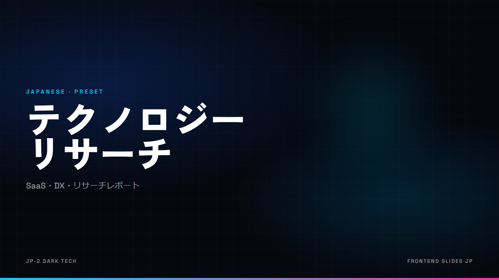<br>
<b>JP-2 Dark Tech</b><br>
<sub>SaaS・DX・リサーチ — Zen Kaku Gothic New + Space Grotesk</sub>
</td>
</tr>
<tr>
<td align="center">
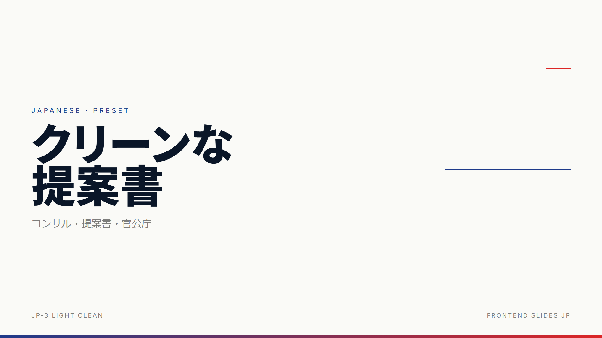<br>
<b>JP-3 Light Clean</b><br>
<sub>コンサル・官公庁 — Noto Sans JP + Inter</sub>
</td>
<td align="center">
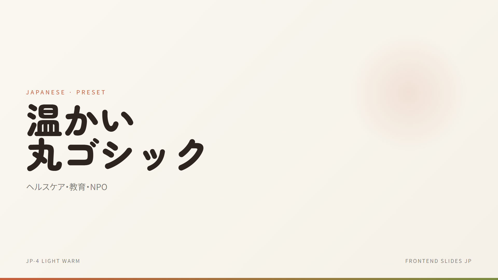<br>
<b>JP-4 Light Warm</b><br>
<sub>ヘルスケア・教育・NPO — Zen Maru Gothic</sub>
</td>
</tr>
<tr>
<td align="center">
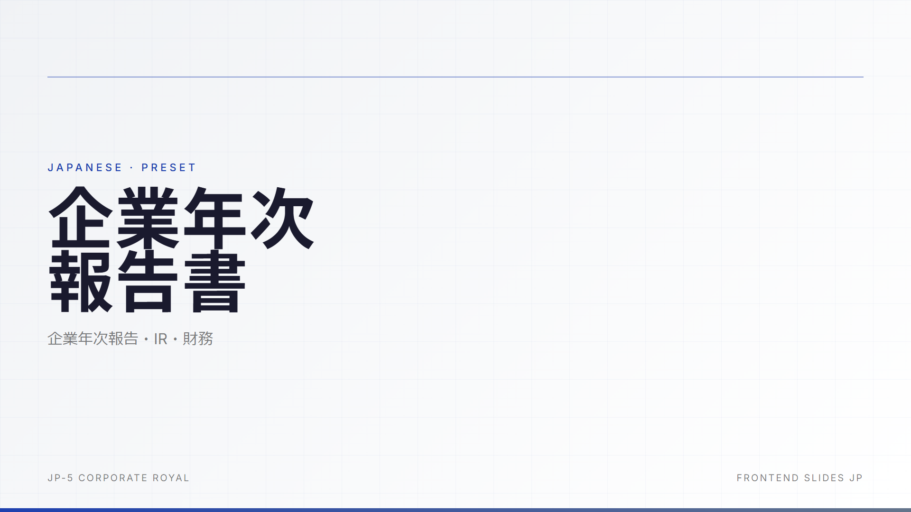<br>
<b>JP-5 Corporate Royal</b><br>
<sub>企業年次報告・IR — Noto Sans JP + Inter Tabular</sub>
</td>
<td align="center">
<br>
<b>JP-6 Dark Creative</b><br>
<sub>メディア・エンタメ — Murecho + Syne</sub>
</td>
</tr>
</table>

### 🌃 Dark Themes (4)

<table>
<tr>
<td align="center" width="50%">
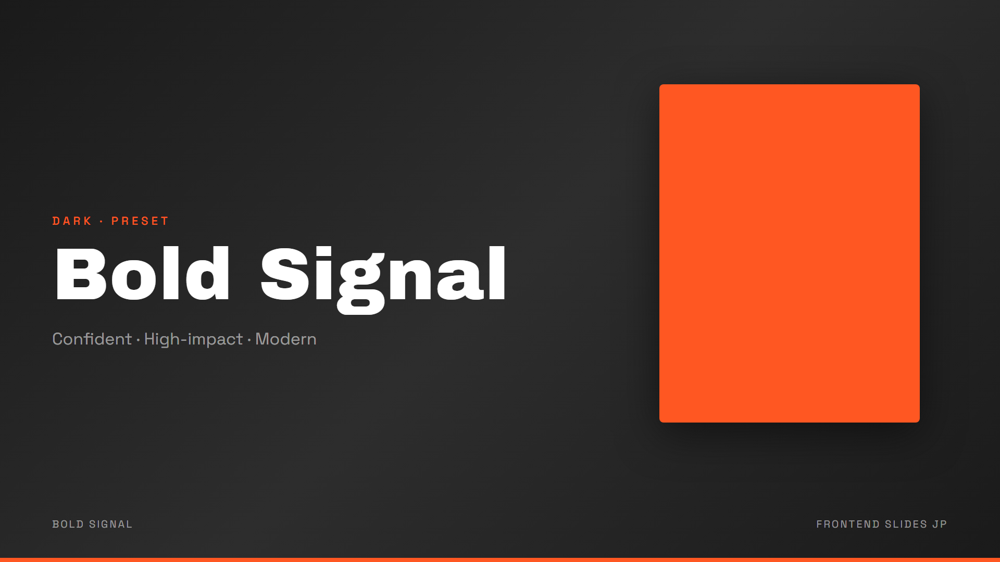<br>
<b>Bold Signal</b><br>
<sub>Confident · High-Impact · Modern — Archivo Black + Space Grotesk</sub>
</td>
<td align="center" width="50%">
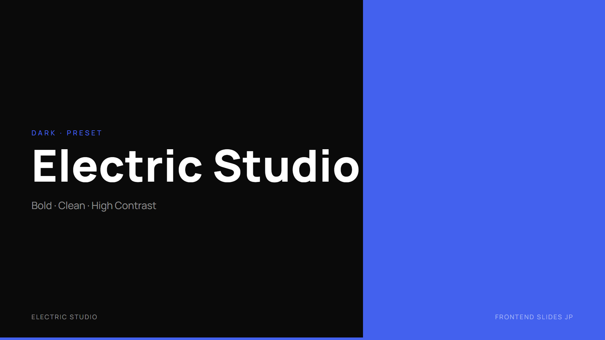<br>
<b>Electric Studio</b><br>
<sub>Bold · Clean · High Contrast — Manrope</sub>
</td>
</tr>
<tr>
<td align="center">
<br>
<b>Creative Voltage</b><br>
<sub>Energetic · Retro-modern — Syne + Space Mono</sub>
</td>
<td align="center">
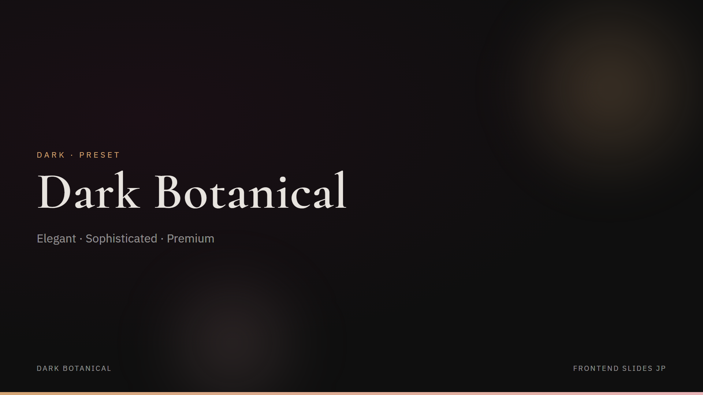<br>
<b>Dark Botanical</b><br>
<sub>Elegant · Sophisticated · Premium — Cormorant + IBM Plex</sub>
</td>
</tr>
</table>

### ☀️ Light Themes (4)

<table>
<tr>
<td align="center" width="50%">
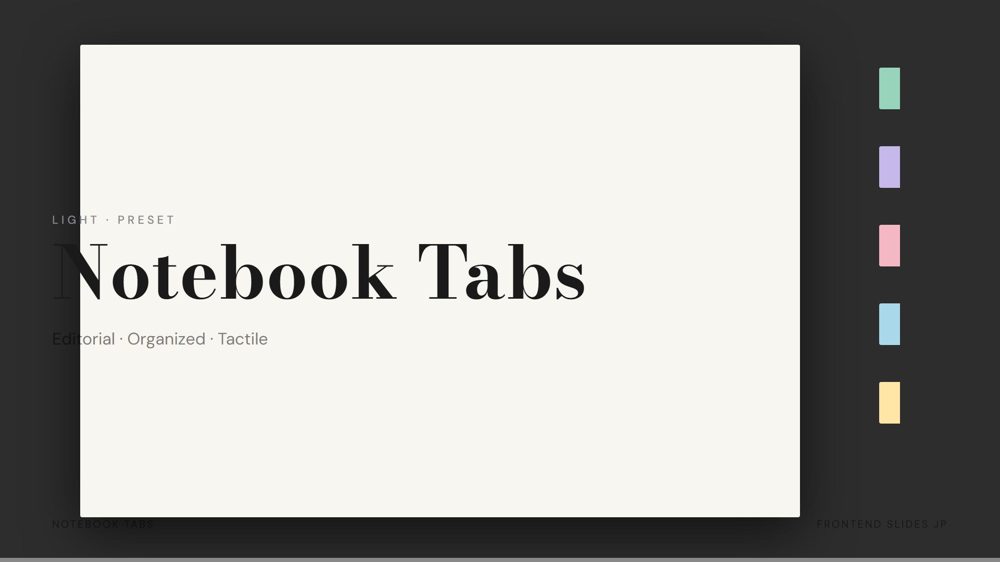<br>
<b>Notebook Tabs</b><br>
<sub>Editorial · Tactile — Bodoni Moda + DM Sans</sub>
</td>
<td align="center" width="50%">
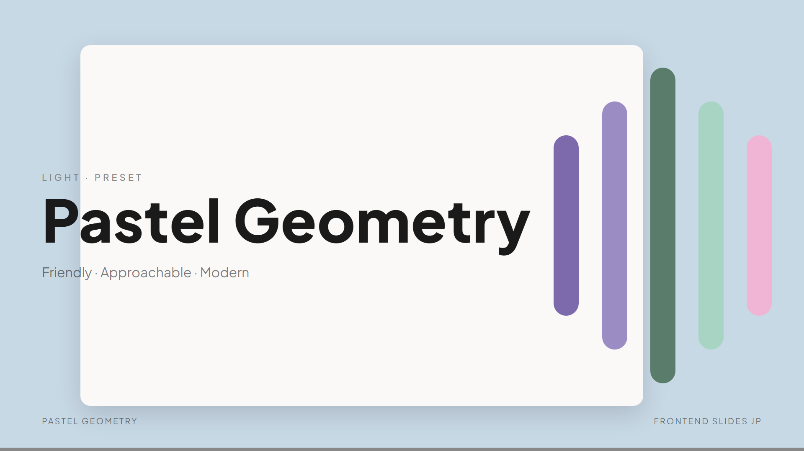<br>
<b>Pastel Geometry</b><br>
<sub>Friendly · Approachable · Modern — Plus Jakarta Sans</sub>
</td>
</tr>
<tr>
<td align="center">
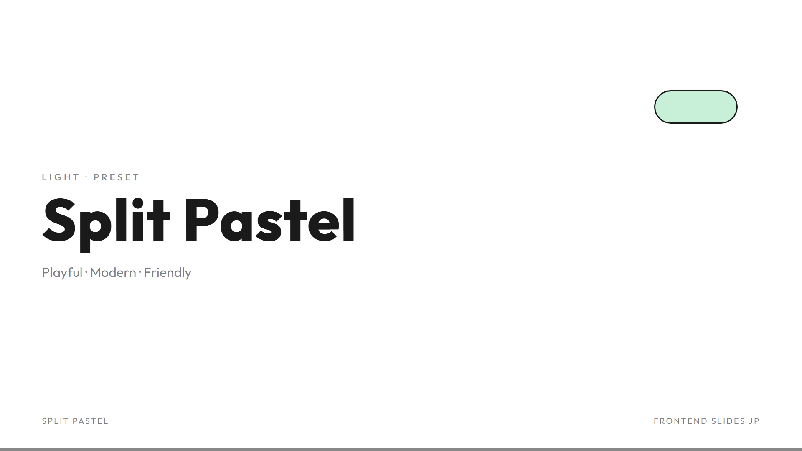<br>
<b>Split Pastel</b><br>
<sub>Playful · Modern · Friendly — Outfit</sub>
</td>
<td align="center">
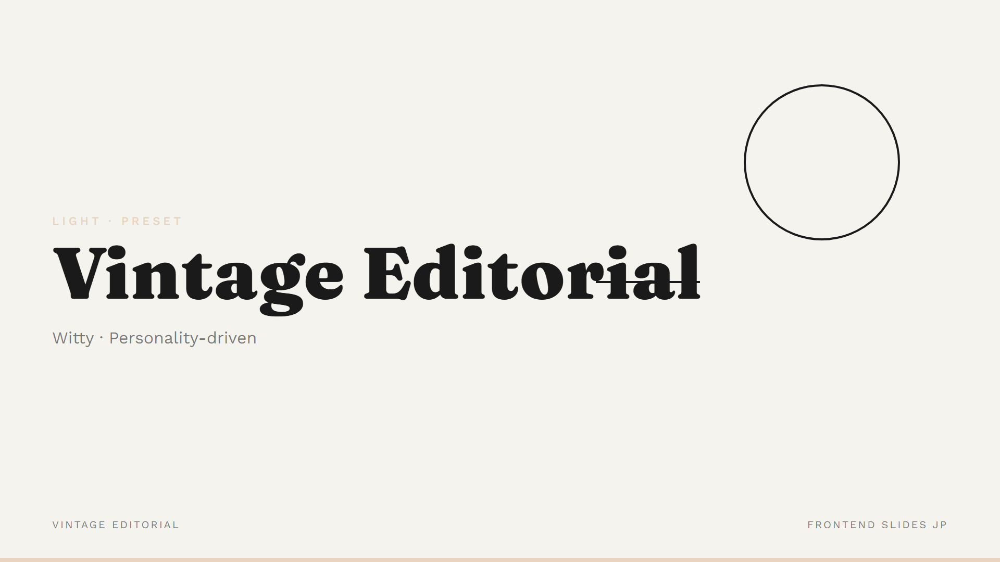<br>
<b>Vintage Editorial</b><br>
<sub>Witty · Personality-driven — Fraunces + Work Sans</sub>
</td>
</tr>
</table>

### ⚡ Specialty Themes (4)

<table>
<tr>
<td align="center" width="50%">
<br>
<b>Neon Cyber</b><br>
<sub>Futuristic · Techy — Space Grotesk + JetBrains Mono</sub>
</td>
<td align="center" width="50%">
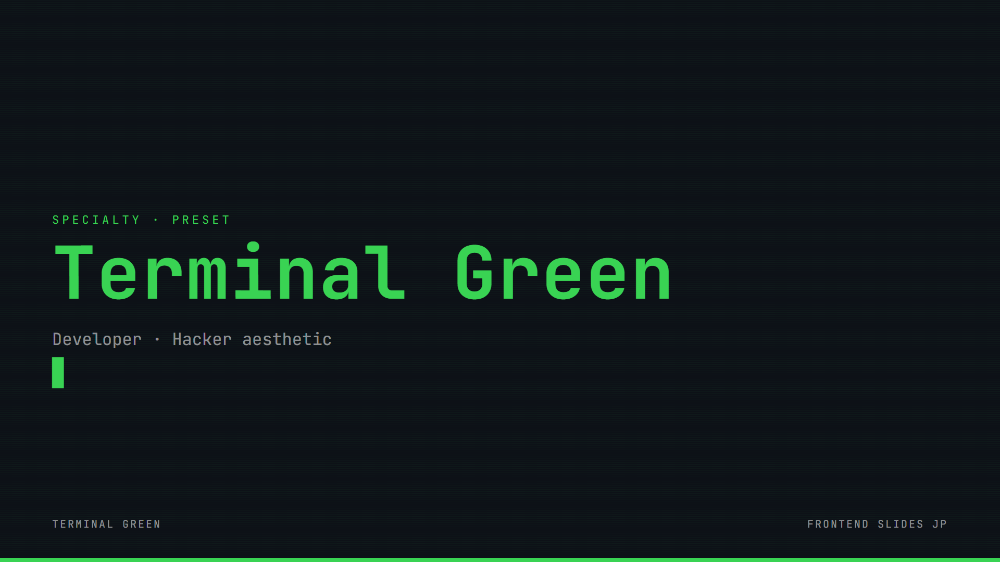<br>
<b>Terminal Green</b><br>
<sub>Developer · Hacker aesthetic — JetBrains Mono</sub>
</td>
</tr>
<tr>
<td align="center">
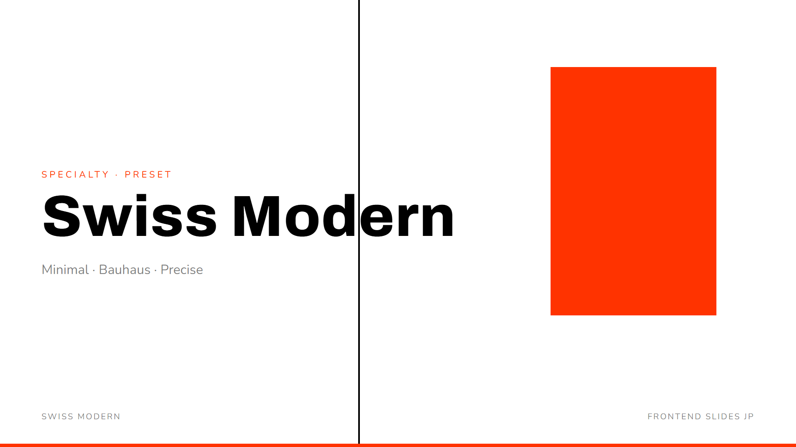<br>
<b>Swiss Modern</b><br>
<sub>Minimal · Bauhaus · Precise — Archivo + Nunito</sub>
</td>
<td align="center">
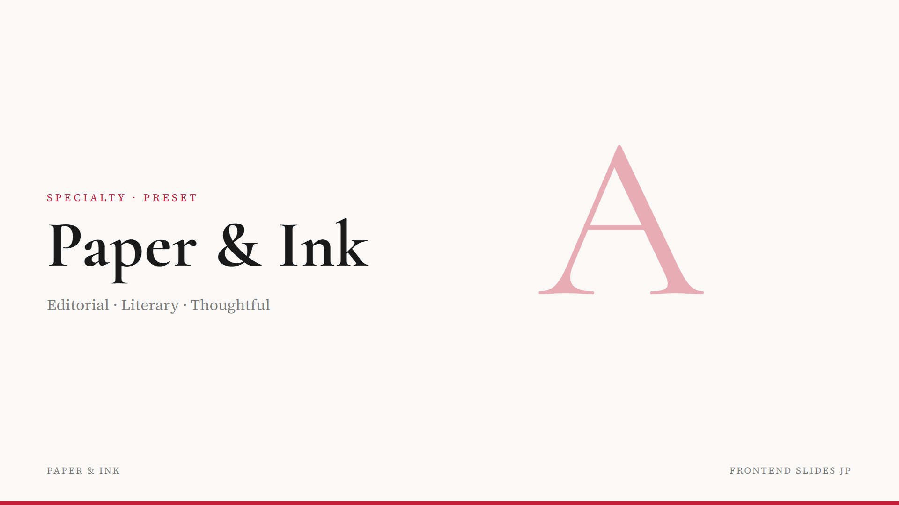<br>
<b>Paper & Ink</b><br>
<sub>Editorial · Literary · Thoughtful — Cormorant Garamond + Source Serif</sub>
</td>
</tr>
</table>

> **備考**: 上記プレビューは各プリセットの「タイトルスライド」1 枚のサンプルです。実際には `title` / `agenda` / `two-col` / `kpi` / `layers` / `flow` / `phases` / `closing` など 11 種のレイアウトを同一プリセット内で組み合わせてデッキを構成します。詳細は [`STYLE_PRESETS.md`](STYLE_PRESETS.md) を参照。

---

## 特徴 (継承部分 + 拡張)

- **ゼロ依存** (HTML 出力) — 単一 HTML ファイル、インライン CSS/JS、npm ビルド不要
- **テキスト選択可能 PDF** — Playwright の `page.pdf()` で実テキストをベクター埋め込み
- **編集可能 PPTX** — PptxGenJS のネイティブテキスト + 図形、PowerPoint で各要素を個別編集可
- **単一データソース** — `slides-data.mjs` だけ書き換えれば 3 形式すべて更新
- **日本語完全対応** — Google Fonts 経由で Noto Sans JP / Zen Kaku Gothic New / Shippori Mincho 等、豆腐文字なし
- **18 プリセット** — オリジナル 12 + 日本語最適化 6
- **PowerPoint 変換** — 既存 PPT/PPTX を Web プレゼンに変換可 (原作機能)
- **Anti-AI-slop** — 紫グラデ on 白、汎用 Inter フォント等の「いかにも生成」デザインを回避

## インストール

### プラグインマーケットプレイス経由 (推奨)

Claude Code で:

```
/plugin marketplace add yukiko10140422-star/frontend-slides-jp
/plugin install frontend-slides-jp@frontend-slides-jp
```

スキル起動: `/frontend-slides-jp`

### 手動インストール

```bash
git clone https://github.com/yukiko10140422-star/frontend-slides-jp.git \
    ~/.claude/skills/frontend-slides-jp
```

もしくは plugin サブディレクトリだけコピー:

```bash
cp -r plugins/frontend-slides-jp/skills/frontend-slides-jp \
      ~/.claude/skills/frontend-slides-jp
```

## 使い方

### 新規プレゼンを作成

```
/frontend-slides-jp

> "AI エージェントのピッチデッキを作りたい"
```

スキルは以下を聞きます:

1. **出力形式**: HTML / PDF / PPTX / 全部 (どれか必須)
2. **目的**: ピッチ / 講義 / カンファレンス / 社内
3. **長さ**: 短 (5-10) / 中 (10-20) / 長 (20+)
4. **コンテンツ**: 素材あり / ラフメモ / トピックだけ
5. **ムード**: Impressed / Excited / Calm / Inspired

その後、3 種類のスタイルプレビューを生成し、選んだスタイルで全スライドをビルド。

### Markdown レポートをスライド化

```
/frontend-slides-jp

> "Downloads の research-report.md を全形式でスライド化して、質問ゼロで"
```

この一文で:
- Markdown を読み込み
- 日本語を検出
- JP-2 Dark Tech プリセットを自動選択
- 12 スライド前後で構成
- HTML + PDF + PPTX を生成
- Obsidian Vault `03-Research/<topic>/` に配置
- インデックスノート `<topic>.md` を作成

### Markdown レポートをスライド化 (英語)

```
/frontend-slides-jp

> "Convert report.md to slides, all three formats"
```

英語モードで同様に処理。

### PowerPoint を Web に変換

```
/frontend-slides-jp

> "presentation.pptx を Web プレゼンに変換して"
```

原作機能のまま。内部で `scripts/extract-pptx.py` が走ります。

## Multi-Format Pipeline の仕組み

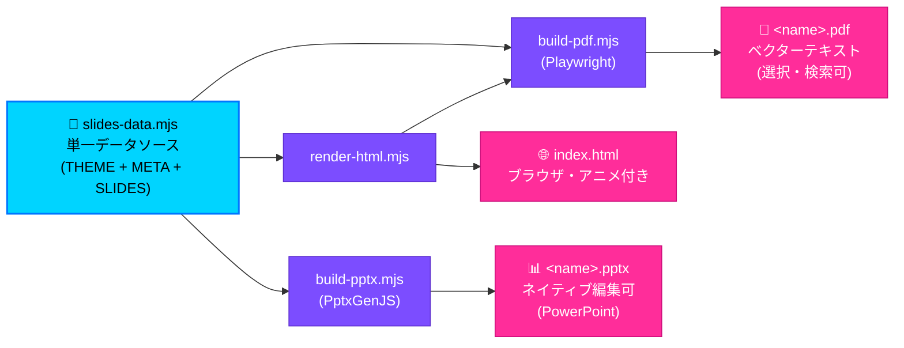

テキスト形式:

```
slides-data.mjs                 単一データソース (THEME + META + SLIDES 配列)
       │
       ├─→ render-html.mjs   → index.html       ブラウザ用 (アニメ付き)
       ├─→ build-pdf.mjs     → <name>.pdf       Playwright page.pdf() (本文ベクター)
       └─→ build-pptx.mjs    → <name>.pptx      PptxGenJS (ネイティブ編集可)
```

### 設計原則

1. **Single Source of Truth** — テキストを編集する場所は `slides-data.mjs` ただ一つ。3 形式すべてがここから派生
2. **Native Elements Only** — PDF はベクターテキスト、PPTX はネイティブ shape/textbox。ラスタライズ禁止
3. **Theme-Driven** — 色・フォントは `THEME` オブジェクトから注入。差し替えで全スライドが一新される
4. **Print-Aware CSS** — `@media print` で PDF 固有のレンダリング差異をカバー

```bash
# 成果物フォルダ (例: Obsidian Vault 内)
cp -r ~/.claude/skills/frontend-slides-jp/scripts/multi-format/* ./my-deck/
cd ./my-deck/
# slides-data.example.mjs を slides-data.mjs にリネームして編集
npm install   # 初回のみ (Playwright + PptxGenJS)
npm run build # HTML + PDF + PPTX を一括生成
```

詳細は [`scripts/multi-format/README.md`](scripts/multi-format/README.md) を参照。

## 対応スライドタイプ (11 種)

| type | 用途 |
|---|---|
| `title` | ヒーロータイトル |
| `agenda` | 目次・アジェンダ |
| `two-col` | 対比・比較 |
| `two-col-bullets` | 対比 + 補足 |
| `kpi` | 3 KPI カード |
| `layers` | アーキテクチャ層スタック |
| `flow` | プロセスフロー |
| `lead-bullets` | 要約 + 箇条書き |
| `bullets` | 純粋な箇条書き |
| `phases` | 3 フェーズロードマップ |
| `closing` | 締め・最終提言 |

詳細と JSON スキーマは [`scripts/multi-format/slides-data.example.mjs`](scripts/multi-format/slides-data.example.mjs) を参照。

## 日本語スライドの必須ルール

(`JAPANESE.md` から抜粋)

- `<html lang="ja">` を指定
- Google Fonts で `Noto Sans JP` + `display=swap` を必ずロード
- `font-family` は欧文 → 和文の順
- `font-feature-settings: "palt" 1` を body か見出しに
- `word-break: auto-phrase` (Safari 17+ / Chrome 119+) + `line-break: strict`
- 本文 `font-size` は **18px 以上**、注釈 **14px 以上**
- `line-height` 本文 **1.8** 以上
- 箇条書きは 1 スライド **5 項目以下**
- 見出しは全角 **20 字以内**
- 生成後は豆腐文字がないか目視 or Playwright で確認

## 動作要件

- [Claude Code](https://claude.ai/claude-code) CLI
- Node.js 18+ (multi-format パイプラインで Playwright / PptxGenJS を使う場合)
- Python + `python-pptx` (PPT 変換を使う場合)

## ライセンス・クレジット

- **ライセンス**: MIT (原作 [zarazhangrui/frontend-slides](https://github.com/zarazhangrui/frontend-slides) を継承)
- **原作**: [@zarazhangrui](https://github.com/zarazhangrui) — v1.x の設計・12 プリセット・PPT 変換・全体哲学
- **日本語拡張・Multi-format 化**: [@yukiko10140422-star](https://github.com/yukiko10140422-star)

## 変更履歴

[CHANGELOG.md](CHANGELOG.md) を参照。

## 既知の問題と回避策

[KNOWN_ISSUES.md](KNOWN_ISSUES.md) に、PDF グラデーションテキスト問題・PPTX の制約・Light テーマ対応状況などをまとめています。

## 貢献

Issue / PR 歓迎。詳細は [CONTRIBUTING.md](CONTRIBUTING.md) を参照。特に:
- 日本語プリセット追加 (JP-7, JP-8...)
- 他言語対応 (韓国語・中国語簡体字/繁体字)
- PPTX 出力のグラデーション表現改善
- slide type の追加
- Light テーマ scaffold 対応
